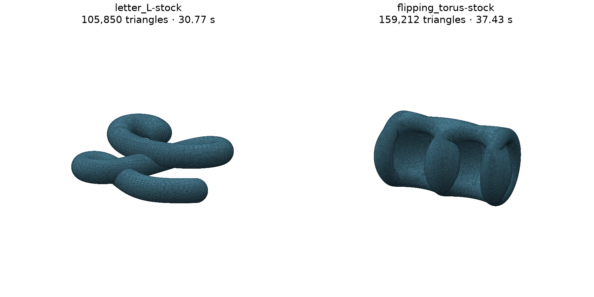
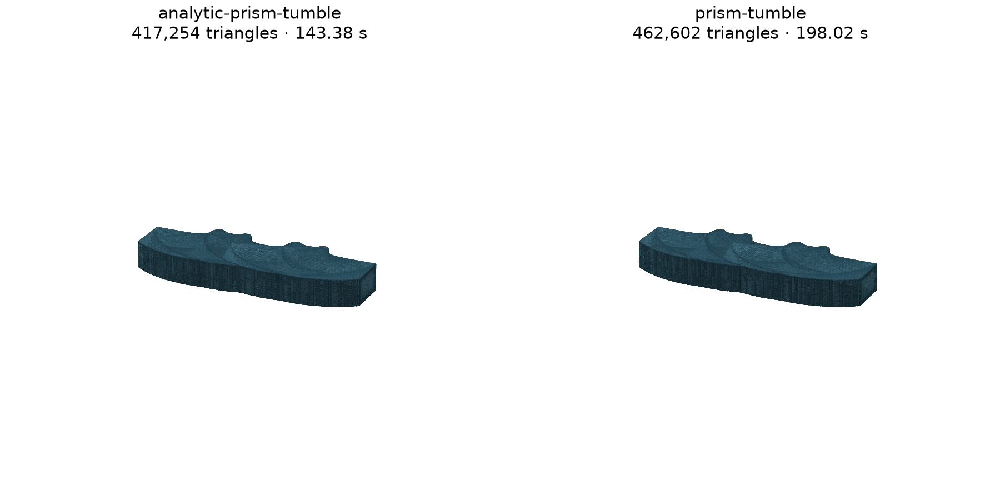

# Running Ju et al.'s sweep reference implementation

Experiment started 2026-09-14. Reference: [Lifted Surfacing of Generalized Sweep
Volumes](https://jurwen.github.io/Swept-Volume-Page/),
[public code](https://github.com/Jurwen/Swept-Volume) at
`0bb260118443545029c98db2e98278fac27ba460`.

**The reference runs both its supplied examples and genuine sharp-edged tumbling
rectangular and triangular prisms.** Tool/sweep STL pairs are available for
inspection. Its raw outputs do not all pass strict mesh-validity checks. The simplest sphere
translation passes our full mesh checks and agrees closely with the analytic
capsule. The curved sphere path and flipping torus produce definite native
float64 defects, before STL encoding. This is useful evidence for evaluating the
method, not evidence that the paper's mathematical construction is incorrect.

**Practical acceptance is a separate question.** The user inspected the stock
tumbling-torus STL in PrusaSlicer, found the shape reasonable, and reported that
PrusaSlicer patched it without difficulty. That repair was user-observed, not an
independently measured repaired-mesh result in this experiment. It substantially
improves the practical assessment: microscopic raw-mesh defects need not block
using this approach if the repair preserves the intended shape. The prism
follow-up below therefore proceeded without requiring every raw exact-coordinate
check to pass first.

## Inspect the actual surfaces

Paired STL files are in
[`experiments/ju-sweep-reference/artifacts`](../experiments/ju-sweep-reference/artifacts):

| Example | Tool at start | Swept solid |
| --- | --- | --- |
| Translated sphere | [STL](../experiments/ju-sweep-reference/artifacts/simple-stock/tool-at-start.stl) | [STL](../experiments/ju-sweep-reference/artifacts/simple-stock/swept-solid.stl) |
| Curved sphere path (`letter_L`) | [STL](../experiments/ju-sweep-reference/artifacts/letter_L-stock/tool-at-start.stl) | [STL](../experiments/ju-sweep-reference/artifacts/letter_L-stock/swept-solid.stl) |
| Flipping torus | [STL](../experiments/ju-sweep-reference/artifacts/flipping_torus-stock/tool-at-start.stl) | [STL](../experiments/ju-sweep-reference/artifacts/flipping_torus-stock/swept-solid.stl) |
| Tumbling rectangular prism, existing OBJ CLI | [STL](../experiments/ju-sweep-reference/artifacts/prism-tumble/tool-at-start.stl) | [STL](../experiments/ju-sweep-reference/artifacts/prism-tumble/swept-solid.stl) |
| Tumbling triangular prism, existing OBJ CLI | [STL](../experiments/ju-sweep-reference/artifacts/triangular-prism-tumble/tool-at-start.stl) | [STL](../experiments/ju-sweep-reference/artifacts/triangular-prism-tumble/swept-solid.stl) |
| Tumbling rectangular prism, analytic API input | [STL](../experiments/ju-sweep-reference/artifacts/analytic-prism-tumble/tool-at-start.stl) | [STL](../experiments/ju-sweep-reference/artifacts/analytic-prism-tumble/swept-solid.stl) |

The STL files are not committed (about 80 MB); regenerate them with `export_stls.py`
as the [reproduction instructions](../experiments/ju-sweep-reference/README.md) describe.
The native `.msh.gz` outputs, audit records and renderings are committed.

The tool files are our parametric tessellations of the analytic primitives in the
reference YAML, placed at time zero. The swept files preserve every upstream
final-surface triangle, converting coordinates to float32 for binary STL. They
have not been welded, remeshed, or repaired. Each pair shares the source coordinate
frame and unitless model scale. `letter_L` is the upstream example name; its tool
is a sphere, not an L-shaped solid.

The figures look plausible at this scale. The measured degeneracies and improper
contacts illustrate why appearance alone is insufficient.

## What was built and checked

The native C++20 command-line executable was built in Release mode on Intel
macOS using AppleClang 17 and CMake 4.4.3. A build-only patch disables unused
strong-type fmt integration to prevent a conflict between Homebrew fmt and
spdlog's bundled fmt. No sweep algorithm source was changed. The optional
`sweep_volume_test` target failed to compile at `igl/doublearea.h`; the CLI built
and ran successfully. No upstream test-suite pass is claimed.

The upstream commit tracks `mtet/main`, so the root commit alone does not fix
the dependency state. The experiment records dependency commits, executable hash,
source diff, exact YAML inputs, logs, timings, mesh hashes, and audit details.
See [reproduction instructions](../experiments/ju-sweep-reference/README.md).

Checks distinguish:

1. Original indexed topology: closed edges, consistent orientation, manifold
   vertex links, connected components, Euler characteristic and signed volume.
2. Exact degeneracy and improper triangle contacts on represented float64
   coordinates, using integer/rational predicates. Coordinate aliases are counted
   separately; a shared coordinate does not establish valid original incidence.
3. The same geometric checks after actual float32 STL encoding and decoding.
4. For sphere translations, volume and sampled distances against the analytic
   capsule. These are not continuous Hausdorff certificates.

The exact predicate suite passes nine controls; the experiment's combined audit
passes three additional controls. Controls include real overlaps, open surfaces,
and a float64-valid surface that collapses under float32 encoding. Meshio warns
when skipping the reference's binary per-corner `ElementNodeData`; the geometry
was cross-checked directly against the binary node and element blocks of all
three stock meshes and matched exactly. The audit does not use those attributes.
All three independently tessellated tool-body STLs also pass the full encoded
mesh checks.

## Definite findings from the supplied examples

| Supplied example | Generation time | Triangles | Original indexed topology | Degenerate triangles, float64 / STL |
| --- | ---: | ---: | --- | ---: |
| Sphere translation | 8.53 s | 87,960 | One closed manifold sphere | 0 / 0 |
| Curved sphere path | 30.77 s | 105,850 | One closed manifold, Euler −2 | 396 / 560 |
| Flipping torus | 37.43 s | 159,212 | Three components; one nonmanifold edge and three invalid vertex links | 1,787 / 2,449 |

Times include process startup and writing the native outputs, and exclude our
audits. Some showcase runs overlapped other audits; these are observations on
this machine, not controlled performance benchmarks.

For the stock capsule, both exact contact scans finished without improper
contacts. There are no coordinate aliases, degenerate triangles or topology
failures in either representation. Its volume is `0.15909160740039877`, versus
the analytic `0.15917402778188286` (about 0.0518% low). The largest sampled
mesh-to-capsule deviation is `2.797e-4`; the sampled reverse-distance upper bound
is `3.737e-4`. Its repeated run and run with both cell filters disabled produced
byte-identical native final meshes.

For the curved path, the collapsed triangles are not merely tiny: distinct
indexed vertices have **identical float64 coordinates**. A retained
[witness](../experiments/ju-sweep-reference/artifacts/letter_L-stock/degenerate-witness.json)
records original triangle 101689 and its hexadecimal coordinates. Its first and
third vertices coincide. The initial short contact scan was incomplete, so the
absence of reported intersections in that scan is not a pass.

For the torus, the native edge `(5397, 5399)` has four incident triangles. The
audit also found improper contacts between nondegenerate triangles; a retained
[contact witness](../experiments/ju-sweep-reference/artifacts/flipping_torus-stock/intersection-witness.json)
was rechecked with exact predicates after decoding its hexadecimal coordinates.
The scans stop at a time or counterexample budget, so recorded contact counts
are lower bounds. The two negatively oriented components could bound cavities;
component count and signed volume alone do not establish correct cavity topology.

The first retained contact pair consists of extremely thin triangles: approximate
minimum altitudes are `2.13e-16` and `7.91e-17` in model units. This is a definite
represented-mesh failure, not evidence of a visually large overlap. The exact
target's contact topology and the paper's genericity assumptions have not been
verified for these inputs. Nonmanifold incidence could also reflect a genuine
contact in the target; these measurements alone do not resolve that distinction.

Turning off both arrangement-cell filters does not remove the failures:

| Example | Triangles, default / no filters | Native degenerate triangles, default / no filters | Nonmanifold edges, default / no filters |
| --- | ---: | ---: | ---: |
| Capsule | 87,960 / 87,960 | 0 / 0 | 0 / 0 |
| Curved path | 105,850 / 105,866 | 396 / 396 | 0 / 0 |
| Torus | 159,212 / 159,450 | 1,787 / 1,793 | 1 / 130 |

The defaults are doing useful cleanup, but are not a validity guarantee. The
unfiltered comparison changes cell selection, not the preceding envelope and
arrangement construction. The short unfiltered contact scans also found torus
failures; the curved-path scans remained incomplete.
Without filters, the curved path additionally has three invalid vertex links;
the torus has 185. Thus checking only open or nonmanifold edges would miss part
of the failure.

## Where the coordinate failures appear

A separate [stage comparison](../experiments/ju-sweep-reference/artifacts/stage-coordinate-checks.json)
counts aliases and triangles with repeated coordinates. This is narrower than
the full degeneracy check: distinct collinear coordinates also produce zero area.

| Example and stage | Coordinate aliases | Triangles with repeated coordinates |
| --- | ---: | ---: |
| Curved path: envelope | 0 | 0 |
| Curved path: arrangement | 201 | 794 |
| Curved path: final surface | 197 | 394 |
| Torus: envelope | 50 | 82 |
| Torus: arrangement | 952 | 3,780 |
| Torus: final surface | 894 | 1,786 |

For the curved path, represented-coordinate collapse first appears in the saved
arrangement. For the torus, it is already present in the saved envelope and grows
through arrangement. This localizes an investigation; it does not yet identify
whether each failure originates in contour construction, projection, arrangement
arithmetic, filtering, or conversion back to floating-point coordinates.

## Controlled comparisons

The complete [measurement table](../experiments/ju-sweep-reference/artifacts/measurements.md)
and [case records](../experiments/ju-sweep-reference/artifacts/results.json) include
the repeat, tolerance, rotation, offset, scale, and filtering comparisons. All
generation commands have a 300-second limit. Sphere-case contact scans use
120-second soft budgets per representation; the complex examples use 15 seconds
because definite degeneracy or topology failures already prevent acceptance.
Their recorded contact counts are not exhaustive. Completed showcase runs were
reused in the aggregate rather than regenerated.

The scaled capsule scales the body, path, bounding box, both refinement epsilons,
and the minimum edge-length floor by 0.1, and disables absolute cell filters.
This is a controlled geometric-scale test, not a claim that changing only model
coordinates while retaining every absolute default is invariant. The offset
control moves the path by `(0.013, 0.017, 0.019)` within the same background box;
the rotation control uses direction `(1, 2, 3) / sqrt(14)`.

Tightening the capsule epsilons from `2e-3` to `5e-4` to `2.5e-4` increases the
triangle count from 22,410 to 87,960 to 202,604 and reduces the measured volume
error from about 0.214% to 0.0518% to 0.0213%. The finest case exhausts both
contact-scan budgets. It has no detected degeneracy or indexed topology defect,
but is not counted as a complete mesh pass.

The initial matrix completed all 12 generation runs. Six cases pass both complete
represented-mesh audits; two have incomplete contact scans; four have confirmed
raw-mesh failures. The small-offset and 0.1-scale capsules pass both full checks.

## Sharp-prism follow-up

The existing CLI accepts OBJ input through a mesh-distance and gradient callback.
The rectangular tool is `0.3 × 0.18 × 0.12`. Its planar faces were subdivided to
768 triangles; this does not round its edges. The triangular prism has 512 input
triangles. Both move from `(0.14, 0.51, 0.5)` to `(0.86, 0.51, 0.51)` while rotating
360 degrees about z. This is the CLI's predefined mesh-input motion, not arbitrary
trajectory support exposed by YAML.

A second rectangular-prism input uses the public API with an exact box signed
distance and analytic spatial/time derivatives. A finite-difference check over
100 space-time points found a maximum derivative difference of `1.74e-10` for
the tumbling motion. The sweep algorithm is unchanged. This separates the
mesh-distance adapter from the sweep engine.

| Input and motion | Generation time | Output triangles | Result |
| --- | ---: | ---: | --- |
| Rectangular OBJ, translation | 300 s budget | — | Timed out during refinement |
| Rectangular OBJ, tumbling | 198.02 s | 462,602 | STL produced |
| Triangular OBJ, tumbling | 177.29 s | 401,708 | STL produced |
| Analytic rectangular prism, tumbling | 143.38 s | 417,254 | STL produced |
| Analytic rectangular prism, translation | 78.56 s | 403,002 | Mesh produced |

The rectangular-prism results look very similar in the rendered comparison.
Their volumes are `0.0345340367` (OBJ) and `0.0345334945` (analytic input), agreeing
within about 0.0016%. This is cross-adapter consistency, not a ground-truth error
bound. The analytic translation control has volume `0.0225593631`, about 0.056%
below the exact translated-box volume `0.022572`.

The prism runs use `epsilon_env=0.002` and `epsilon_sil=0.005`, with the default
snapping and cell filters. The analytic adapter additionally caps refinement at
200,000 splits. We did not establish whether that cap was reached, so these
meshes do not certify convergence to the requested epsilons. For API runs,
`mesh/input.json` and the recorded command specify the actual inputs; the common
runner's `config.yaml` is not read by that API executable.

Raw prism meshes still fail strict validity checks. The OBJ rectangular prism
has 20 nonmanifold edges and 3,643 native degenerate triangles; the triangular
prism has 30 and 2,927 respectively. Full details are in the
[prism measurement table](../experiments/ju-sweep-reference/artifacts/prism-measurements.md)
and [case records](../experiments/ju-sweep-reference/artifacts/prism-results.json).

An independent sampled input-field check evaluated 8,192 rectangular-mesh
vertices/centroids over 2,049 poses. The OBJ output had 24 samples more than
`0.002` inside at least one tool pose. Its worst sample was `0.0114` inside, but
that vertex's incident triangles have total area only `6.89e-33`. Other residuals
are supported by nonzero-area triangles. The analytic adapter's worst sample was
`0.0171` inside, with incident area `2.09e-5`; its refinement budget is an additional
limitation. Thus not every local error can be dismissed as coordinate roundoff.
The check measures the sampled min-over-time input field, not Hausdorff distance,
whole-surface coverage, or repaired-mesh accuracy. Its records are retained next
to the respective STL files.

**The practical prism milestone is achieved: the reference can produce these
sharp-tool sweep meshes for slicer inspection.** Whether a repair preserves the
desired surface and dimensions remains the next practical check. The raw strict
audit and the user's successful torus-repair experience should both inform that
assessment.

## Implications for Solvent

This is a promising executable baseline for a general smooth-implicit sweep
algorithm, and gives us a much better starting point for progressive examples.
It is **not yet a drop-in robust surface backend**. Native coordinate collapse,
nonmanifold incidence, and export precision remain explicit acceptance problems.

The next practical investigation is the same visual and slicer check on the
delivered prism STL pairs. Preserve the native audits as diagnostics. If repaired outputs are useful, measure
the repair's volume, feature, and topology changes and make that repair an explicit
part of a candidate workflow. A separate stricter investigation can use the saved
witnesses to identify the responsible library stage. Deleting zero-area triangles
alone does not establish a valid replacement, but failure of the strict raw-mesh
gate is not by itself a reason to abandon a practically successful method.

The initial sphere/torus matrix uses smooth analytic fields. The prism follow-up
exercises the CLI's mesh-distance callback and a small box-distance API adapter,
not Solvent's own field adapter.
Neither establishes arbitrary thin-feature recovery, Boolean tool support,
cyclic motions, cutter subtraction, or hypoid gear manufacture. This experiment
does not change the existing Phase 3 implementation or claim that its remaining
work is complete.
