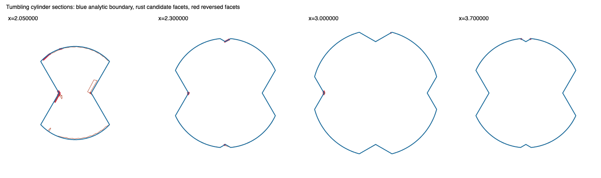

# Phase 1a: preserve source ownership and refresh the baseline

2026-09-13. Implementation on `2331234`, preserving the Phase 1 replay and negative
controls. This checkpoint repairs source metadata and measures the consequences of that
repair. The geometric alias/zip rules, tolerances, material field and acceptance contract
are unchanged.

## Repair and checks

Crease merging previously removed collapsed triangles without removing their source labels.
It now uses the independently recorded surviving original-triangle indices to retain the
matching labels **before** splitting creates children. The vertex aliases, retained triangle
order and split rules are unchanged.

Construction checks each mesh stage for finite coordinates, valid vertex indices, one source
label per triangle, and source IDs within the seed inventory (or the explicit `u32::MAX`
constructed-band marker). A malformed stage returns `InvalidStageMesh` with its stage name.
Low-level edits assert aligned arrays before mutation, preventing zip truncation or a later
filter from hiding malformed input. These structural checks cannot prove semantic ancestry;
that is checked separately in the ownership regressions and cylinder replay.

The mutation review covered crease clipping/removal, planar union fragments, overlap cuts,
welding/collapse, splitting, duplicate/sliver removal, retention, compaction and zip insertion.
The unpaired removal was in crease merging. The other reviewed paths retain labels with the
same triangle indices, inherit a fragment's source, or mark newly constructed bands explicitly.

Four regression tests exercise:

- Removal of an early triangle followed by splitting adjacent surviving sources, duplicate
  removal, welding, retention and compaction. Surviving facets are assigned independently to
  their original geometric parent domains, so a shifted but equal-length label array fails.
- Partial overlap trimming: the earlier covering triangle keeps its label, and the new pieces
  inherit the source being cut.
- Missing and stale extra source entries: low-level edits refuse before changing the mesh.
- Filling a missing tetrahedron face: existing labels persist and the new face has explicit
  constructed provenance.

The ownership regression was run against the old implementation and failed on the stale
array before the repair. The initial overlap test used an unnecessarily fine grid tolerance
and that run was interrupted; its corrected, practical tolerance is unrelated to the repair.
The final validation below applies to the completed tests.

## Replay and evidence limits

The existing Phase 1 reporter is reused. It now asserts source alignment/range at each stage,
checks retained labels against original triangle indices, and compares the actual splitter
output with an independent reconstruction of parent ownership. It exports the complete strict
centroid certificate and query statistics, in addition to the existing oracle, sections,
merge/cut/zip decisions and field witnesses.

The original Phase 1 bundle and the three frozen alias/zip mesh controls are unchanged. The
refreshed run uses the same source, options, quadrature resolutions and probe distances.
Triangle-distance coverage is evaluated at 0.01, 0.02 and 0.04. Area-weighted probes and volume
quadrature remain diagnostics, not whole-surface acceptance proofs; the oriented volume sum
of an open mesh is not a valid enclosed volume.

## Measured effect on the cylinder

At the crease-retention boundary, there are now 3,744 triangles and 3,744 labels.
Independent parent mapping reports zero wrong labels, both there and after splitting.
The four corrected live entries after merging are triangles 3747, 3760, 3762 and 3764:
all belong to source 9 rather than source 10.

Compared with the frozen Phase 1 stage meshes, vertices and triangle indices are exactly
identical through planar union. The four label corrections persist through those stages.
**The first geometric change occurs in overlap trimming**, where the corrected ownership
changes which earlier sheet covers a triangle: 59 old oriented facets are absent and 25
new ones appear, reducing that stage from 5,025 to 4,991 triangles. Later changes follow
from that different input; no geometric rule was modified.

| final cylinder diagnostic | Phase 1 | Phase 1a |
|---|---:|---:|
| triangles | 6,129 | 6,033 |
| open loops | 10 | 13 |
| strict centroid checks passed | 5,527 | 5,473 |
| strict centroid checks failed | 350 | 324 |
| strict centroid checks unresolved | 252 | 236 |
| triangle area | 28.203018 | 27.925501 |
| reversed area, 64 samples/facet at probe 0.02 | 2.013046 | 1.910498 |
| reversed centroid-weighted area farther than 0.04 from open edges | 1.753595 | 1.667970 |
| oriented triangle volume sum (open mesh) | 9.292605 | 9.326207 |

The candidate remains refused at topology (`EdgeUseCount`, edge 206 used once), with
substantial geometric failures independent of closure. Neither fewer triangles nor the
changed loop count is an acceptance result.

The area estimated farther than 0.02 from the candidate is unchanged at reference
resolution 128: 0.103349. At threshold 0.01 it changes from 5.668523 to 5.668995.
The maximum sampled boundary-to-triangle distance remains 0.033879, with no sampled
reference area beyond 0.04. Refinements 32, 64 and 128 and all stage comparisons are
retained in the report. This is sampled distance coverage, including chord error,
not a proof that the mesh is complete or that its overlaps are admissible.

## Phase 2 handoff

The earliest robust reversed alias remains clipped triangle 2701 on true source patch 10:
vertex 4052 is identified with 2046, moving a correctly oriented cap triangle inward.
Its before/after geometry is unchanged from the Phase 1 frozen negative control, and
strict field probes still confirm the reversed sides. The downstream small-fan proposal
also reproduces the same unsupported geometry, despite vertex renumbering.

The refreshed local zip window has 214 triangles and source labels 6, 9 and 10. Its sampled
reversed area remains 0.002526. No validated outer interface has been established, so
**retain all eleven source patches, including both roll caps, as the conservative
interacting group**. The window is an inspection aid, not a replacement boundary.

The next discriminating experiment is Phase 2's shared-boundary construction, beginning
before the unsafe crease identification. Use the corrected pre-merge candidate, source
patches and the independent cylinder oracle to establish the relevant shared trim curves,
then tessellate with common boundary samples. Compare against this corrected baseline,
checking material sides, both distance directions, topology and overlaps. A smaller
replacement is justified only if its interface to retained geometry is validated.

Phase 1a does not require cylinder acceptance. Its deliverable is reliable source ownership
and a measured baseline from which this geometric experiment can proceed.

## Validation and preserved artifacts

| check | result |
|---|---|
| full core suite | 1,240 passed, 0 failed, 96 ignored; 177.97 s |
| explicit cylinder oracle/reference/negative controls and replay | 5 passed; 56.07 s |
| candidate status/export matrix | passed; 128.15 s |
| exported bytes versus Phase 1 | 11 of 16 files identical; four STLs and the status table changed |
| renders | both overall and selected-region section SVGs rendered and visually inspected |
| frozen Phase 1 alias/zip geometry | byte-identical before/after alias and proposed zip triangle |
| whitespace | `git diff --check` passed |

The changed STLs are the turning prism, cylinder and two perturbed cylinders. Lens,
turned-box and whole-turn-box STLs remain byte-identical, as do all eight source files.
The dumbbell's earlier construction refusal is unchanged. Refreshed strict field and
topology reports validate the changed cases as **refused candidates**, not accepted solids:

| case | triangles before → after | failed centroids before → after | unresolved before → after |
|---|---:|---:|---:|
| turning prism | 1,065 → 1,049 | 25 → 20 | 0 → 0 |
| cylinder | 6,129 → 6,033 | 350 → 324 | 252 → 236 |
| cylinder perturbation 0 | 6,821 → 6,731 | 469 → 442 | 363 → 355 |
| cylinder perturbation 1 | 6,385 → 6,271 | 373 → 329 | 318 → 307 |

The cylinder comparison isolates the changed geometry to source-sensitive overlap trimming;
no geometric rule was changed for any case. Perturbation sensitivity and geometric failures
remain Phase 2 construction obligations. The ordinary curved audit calibration passed in the
full suite. The expensive ignored fine continuous calibration was not repeated because the
field and spatial audit are unchanged.

- [Corrected replay bundle](fixtures/cylinder-phase-one-a/replay.tar.gz): pre-merge and later
  stage meshes, every zip round, source parameters/labels, actual decisions, complete centroid
  certificate and statistics, field witnesses, exports, validation logs and the Rust overlay
  on `2331234`. The reproducible analytic reference mesh and duplicate per-source text dumps
  are omitted; the complete source inventory remains in `seeds-and-label-witnesses.txt`.
- [Manifest](fixtures/cylinder-phase-one-a/manifest.json): all member sizes and SHA-256 hashes,
  baseline identity, restore instructions and validation outcomes. Every member was checked
  after writing the archive.
- [Stage comparison](fixtures/cylinder-phase-one-a/stage-comparison.json),
  [measurement report](fixtures/cylinder-phase-one-a/report.txt),
  [status matrix](fixtures/cylinder-phase-one-a/status.tsv) and
  [export comparison](fixtures/cylinder-phase-one-a/export-comparison.json).

To regenerate the diagnostic run and export matrix, use separate artifact directories:

```sh
SOLVENT_EXPORT=/private/tmp/cylinder-phase1a-replay \
  cargo test --manifest-path rust/Cargo.toml -p gcs-core --test core \
  sweep_mesh::cylinder_replay::phase_one_cylinder_replay -- --ignored --nocapture
SOLVENT_EXPORT=/private/tmp/cylinder-phase1a-exports \
  cargo test --manifest-path rust/Cargo.toml -p gcs-core --test core \
  sweep_mesh::status::phase_zero_status -- --ignored --nocapture
```

The historical exporter names are retained so one reporter serves both baselines.
Phase 1a's checkpoint is complete; Phase 2 is the next implementation step.


