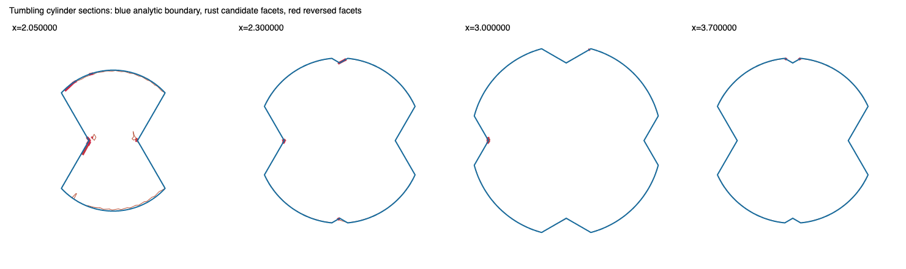

# Phase 1: independent cylinder geometry and construction replay

2026-09-13. Based on `a996167` plus the uncommitted Phase 0a implementation.
This phase adds test-only geometry and read-only construction observers. It preserves
candidate geometry and does not implement the Phase 2 replacement.

## What the independent oracle establishes

`tests/sweep_mesh/cylinder_oracle.rs` describes the cylinder directly:
`(x-3)^2+y^2 <= 1`, `|z| <= 1`, rotating about x through ±30 degrees.
At fixed x, the swept section is the union of rotated rectangles. Its radial maximum
is attained at a roll endpoint or a rectangle corner direction within the roll interval.
The implementation evaluates those finite candidates; it does not call the material
field, sample poses to define the solid, or use the contact tracer.

The limiting sections at x=2 and x=4 are two filled sectors, forming planar end faces
of the 3D solid. Ignoring them gives an incomplete reference surface. The axis, zero
roll, angular wrapping and full-turn limit have explicit tests. A small binary64
roundoff guard handles the discontinuous radial function at an end-sector edge.
The full-turn volume is independently checked against `10*pi/3`; zero roll against
`2*pi`. Dense inverse-rotation samples provide an additional lower-bound cross-check.

Midpoint volume quadrature uses `x=3+sin(u)` to remove the endpoint square-root
singularity. The ±30-degree results are:

| subdivisions | volume |
|---:|---:|
| 64 | 9.426575347204 |
| 128 | 9.426405255660 |
| 256 | 9.426363527378 |
| 512 | 9.426353125621 |
| 1024 | 9.426350471573 |

These are convergence measurements, not interval-certified volume bounds. Likewise,
point membership guards and radial differences are not spatial distance certificates.
The Phase 0a acceptance contract is unchanged.

The reference mesh follows the moving corner directions explicitly and includes both
end faces. Its volumes at resolutions 32, 64 and 128 are 9.394870253527,
9.418470968495 and 9.424379155459. At resolution 64, no sampled facets reverse and
more than 99% of its area has the correct material sides at probe distance 0.02.
Reversing its facets and withholding a patch are permanent negative controls.
This reference is a converging diagnostic approximation, not an accepted production mesh.

## Fresh geometry evidence

The current candidate still contains 6,129 triangles and ten open loops. Its oriented
triangle volume sum is 9.292604831976; because it is open and overlaps/reverses, this
sum is not a valid enclosed-volume measurement. Its triangle area is 28.203018,
compared with approximately 23.502856 for the resolution-128 reference.

The reporter probes equally weighted subtriangles, uses distances to **triangles**
through a test-only BVH, and intersects facets with section planes. It does not infer
missing area from distance to vertices. BVH queries are checked against brute force,
including a point in the middle of a large triangle far from all its vertices.

At probe distance 0.02, the estimated reversed area converges as follows:

| subtriangles per facet | reversed area |
|---:|---:|
| 1 | 1.994494 |
| 4 | 2.013357 |
| 16 | 2.009919 |
| 64 | 2.013046 |

Of the centroid-weighted reversed area, 1.753595 lies more than 0.04 from the
candidate's open **edge segments**. Reversals are not confined to the remaining loops.
At the same probe distance, crease-clipped geometry has essentially no reversed area;
crease merging introduces approximately 0.007554, and zipping raises it to 1.994494.
These are diagnostic point probes with area weights, not whole-facet certificates.

At reference resolution 128, the largest sampled boundary-to-candidate triangle
distance is 0.033879. None of the sampled reference area exceeds the current 0.04
threshold. This does **not** prove complete coverage: finer distance thresholds and
sample refinements are reported separately, and no unsampled region is certified.
At threshold 0.02, the estimated area beyond the threshold is 0.1863, 0.0946 and
0.1033 across reference resolutions 32, 64 and 128; at threshold 0.01 it is 5.8192,
5.7229 and 5.6685. This is distance-threshold coverage (including chord error), not a
measurement of topological holes. The finest reference's own maximum sampled chord
distance is 0.000228, well below those thresholds.

This establishes why treating this solely as a large missing-patch problem is
misleading. The section overlays also show near-coincident outlines alongside
interior fragments; outline agreement cannot establish outwardness or multiplicity.

## Actual decisions and provenance

The production operations expose read-only observers:

- `merge_creases_observed`: the actual vertex alias map before mutation and the
  surviving triangles' original indices after removal.
- `clip_overlaps_observed`: each source triangle/piece, covering sheet, candidate
  covering triangles, outline and actual remaining pieces before replacement.
- `rim_zip_observed`: round snapshots, small-fan preflights, oriented proposals,
  rejection reasons and the applied triangle indices.
- `loop_span_observed`: the actual fallback projections, including strict bracket
  witnesses or unresolved/error results. Extra diagnostic probes are explicitly
  distinguished from evidence consulted by the construction.

One reporter runs these operations on captured pipeline inputs and requires exact
vertex, triangle and sheet-array equality with their production outputs. IDs are
qualified by stage/round and refer to immutable snapshots. Spatial nearest-neighbor
matches are labelled proximity, never ancestry.

### An earlier barrier: provenance becomes invalid in crease merging

`merge_creases` aliases vertices and removes triangles whose indices collapse,
but does not remove the corresponding `mesh.sheet` entries. Consequently, later
triangles inherit other triangles' sheet IDs. The later `retained` operation makes
the array lengths agree again, hiding the mismatch without restoring the identities.
Those IDs are consumed by planar unions and overlap trimming, so this affects the
geometry construction, not only diagnostic labels.

On this fixture, removal leaves 3,744 triangles and 3,873 sheet entries. All 129
removed triangles are from the last sheet, so the surviving labels initially still
agree. The subsequent splitter appends new labels behind those stale entries. Replaying
the same splitter with only the metadata corrected gives **identical geometry and four
different live sheet labels**, isolating this defect from geometric alias deformation.

The observer retains an independent original-triangle map and records every mismatch.
Downstream sheet numbers in the archived trace are **pipeline labels**, not reliable
source ancestry. They must not be used as the foundation for a shared-boundary
arrangement. Phase 1 preserves this defect for reproducibility; repairing it is an
explicit prerequisite to the Phase 2 comparison, followed by regenerating the baseline.

### The earlier unsupported alias

Clipped triangle 2701 belongs to true source patch 10, the second roll cap. Its
material sides are correct at probe distance 0.02 before merging. The alias map
replaces vertex 4052 with vertex 2046:

```text
before: [2.226989546637263,-0.742760075075957,0.017711619537941]
after:  [2.238769144308900,-0.746983916657101,0.002769212448123]
```

The other two corners are unchanged. The move is within the 0.02 snap tolerance,
but the resulting triangle reads exterior inside/material outside at 0.01 and 0.02.
This is the first robust reversed alias encountered by the reporter's ordered scan,
not a claim that every earlier triangle was certified. Separate strict field probes confirm the reversed sides at 0.01, 0.02 and 0.04.
The exact before/after triangle, pre-alias candidate, alias map, source labels and
required analytic surface are frozen.
The unsupported decision is identifying nearby rim vertices without establishing that
the identification preserves the retained patch's geometry and material side.

This counterexample is earlier than zipping and independent of the sheet-array defect:
the alias changes the geometry before triangle removal misaligns the metadata.

### A concrete unsupported zip emission

In round 0, small-fan proposal 7 emits triangle `[1229,1044,5121]` at centroid
`[2.001780619921432,-0.078766633090136,-0.061958664864374]`, with normal
approximately `[0.9997140863,0.0185772547,-0.0150542752]`.
The quad fan passed the area, directed-edge and duplicate-facet tests. The small-fan
pass consulted no field witness before adding it at triangle index 5079.

The independent oracle reads **exterior on its nominal inside and material on its
nominal outside**, at all three probe distances 0.01, 0.02 and 0.04. Separate strict
field queries agree. At 0.02, the exterior value enclosure is
`[0.0062849532,0.0189116106]` and the material enclosure is
`[-0.0710562481,-0.0210843719]`. This is an actual unsupported emission, not a
prediction made from the finished loops. The artifact contains its candidate before
mutation, the preflight, exact points, incident triangle indices, application result,
source geometry, options and independent witnesses.

## Reconstruction scope and next step

The local crop around the zip proposal contains 256 triangles and pipeline labels
6, 9 and 10. Its own sampled reversed area is approximately 0.002526 at probe 0.02. Those labels are corrupted upstream and are not proof that three source
patches suffice. The crop's outer interface has not been validated, and other reversed
regions exist away from its boundary. It is a diagnostic window, not an authorized
replacement boundary.

Use the **entire interacting cylinder source-patch group**, including both roll caps (eleven source patches, IDs 0–10),
as the conservative Phase 2 scope until a smaller validated interface can be established.
First repair and enforce triangle/source identity through removal, splitting and
compaction. Then regenerate the oracle/stage report and choose the shared-boundary
experiment from that baseline. Keep these frozen counterexamples as negative controls;
do not require the repaired construction to reproduce the old failure counts.

The observations support removing topology-only permission to invent bands and
proximity-only permission to identify boundaries. They do not yet prove that the
proposed shared-boundary construction succeeds.

## Reproduction and validation

The ordinary oracle, reference and frozen-counterexample tests are registered in the
existing `core` test binary. The full diagnostic exporter is ignored because it writes
artifacts and must be invoked explicitly:

```sh
SOLVENT_EXPORT=/private/tmp/cylinder-replay \
  cargo test --manifest-path rust/Cargo.toml -p gcs-core --test core \
  sweep_mesh::cylinder_replay::phase_one_cylinder_replay -- --ignored --nocapture
```

The artifact directory contains source/options, every stage mesh, seed parameters and
label brackets, actual cut/merge/zip decisions, fallback field witnesses, analytic
reference geometry, area/distance/volume refinements and SVG section overlays.
The durable fixture bundle and final validation results are recorded below.

- [Frozen replay bundle](fixtures/cylinder-phase-one/replay.tar.gz): the full before/after
  candidates, source patches/parameters, all round snapshots, decision traces, witnesses,
  options and the Rust working-tree overlay on `a996167`. The overlay includes Phase 0a.
  The independently generated reference mesh is omitted from the bundle because the
  included oracle regenerates it; all measured reference results are retained.
- [Manifest](fixtures/cylinder-phase-one/manifest.json): SHA-256 and size of every archived
  file, restore instructions and validation results. Every member was read back and checked.
- [Measurement report](fixtures/cylinder-phase-one/report.txt): complete numeric refinements,
  field bounds and stage-qualified identities. `away_reversed_area` is evaluated only in
  the one-sample-per-triangle rows; its zeros in finer quadrature rows are not measurements.
- Three small plain-text mesh fixtures in `tests/sweep_mesh/fixtures/cylinder-phase-one/`
  run as ordinary permanent negative controls, independently of future candidate behavior.

Validation on the completed implementation:

| check | result |
|---|---|
| full core suite | 1,236 passed, 0 failed, 96 ignored; 168.54 s |
| oracle/reference/frozen controls plus explicit replay exporter | 5 passed; 22.70 s |
| Phase 0 status/export matrix | all 16 source/STL/status files byte-identical to Phase 0a |
| section renders | both full and selected-region SVGs rendered and visually inspected |
| whitespace | `git diff --check` passed |

The expensive ignored Phase 0a fine continuous calibration was not rerun: this phase changes
construction observation and test support, not the field or spatial audit. The ordinary
curved calibration did pass in the full suite. No production geometry fix or accepted swept
solid is claimed by this phase.


