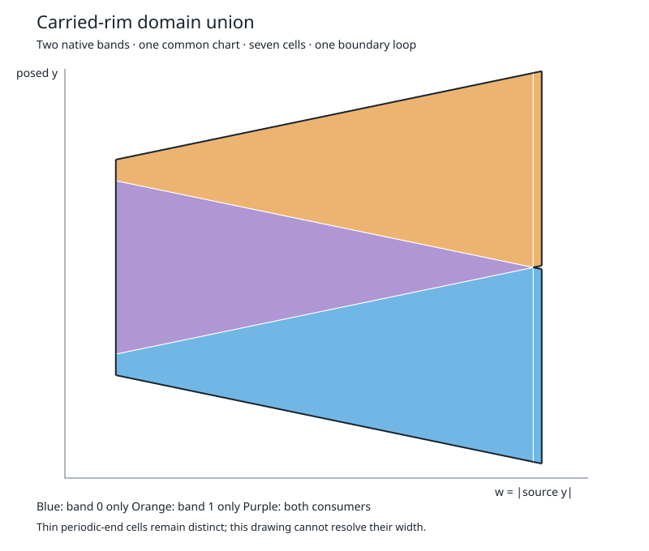

# Phase 3d: union of carried-rim domains

This completes the bounded two-band construction in the
[Phase 3 subphase plan](swept-boundary-phase-three-plan.md). The result is a domain union on
an analytically established carrier, with shared oriented arcs and every covering native
consumer. It is not yet a visible swept-solid boundary or a production cylinder mesh.

## Output and inspection

`solid::swept_boundary::arrangement::carrier::union::Union` borrows a Phase 3c
`Correspondence`. `build` returns cells, shared edges, vertices with coordinate enclosures,
and oriented boundary loops. Each cell retains indices into the correspondence's regular
regions; those retain the original bands, edges, native rectangles and inverse branches.
Overlapping or duplicate inputs therefore keep all consumers without emitting duplicate cells.

The original edge-0 bands, `t = [0.01, 0.1]` and `[0.9, 0.99]` over the full tumble roll,
produce **seven cells and one union boundary loop**. The chart area is approximately
`0.8206904159717748`. This is area in the common parameter chart, not area on the sphere.



The accompanying [incidence and native-map report](fixtures/cylinder-phase-three-d/union.tsv)
retains vertex enclosures, edge uses, cell consumers, representative native evaluations and
the boundary walk. The vertex table also retains auxiliary line/cut intersections; edge
uses define the union's actual topology. The narrow periodic-end cells are too small to resolve in the drawing;
they remain separate in the arrangement and report. The diagnostic does not triangulate or
claim a closed solid.

`coordinates` samples a cell's chart, `consumers_at` evaluates all its covering source charts,
and `edge_at` evaluates an entire shared arc through all incident consumers.
`edge_consumers` supplies the corresponding region indices. `consumer_orientation` gives each
native map's sign into the common chart. Cell boundaries are counterclockwise in that chart;
this is not an outward material orientation.

## Construction

The supported geometry is the Phase 3c coordinate-axis circular-edge relation, further
restricted to regular regions that share one projection chart, one source-axis/radial family
and one sign of the axial source coordinate. The source coordinate transverse to both axes
must also have a fixed nonzero sign on each region. Unsupported chart combinations refuse
explicitly; this is not a general arrangement of every chart on the sphere.

Let `m` be the motion axis, `s` the source-circle axis and `k` the remaining coordinate.
Relative to the common centre, write the source point as `(x, q, h)` on these axes. Its
circle equation is `x² + q² = radius²`, and `h` is constant. Use

```
w = |q|
y = the retained transverse posed coordinate relative to the common centre
```

as the arrangement chart. The fixed axial sign makes `w` an injective replacement for the
Phase 3c axial coordinate. At a fixed roll, rotation makes `y = a*w + b`; coefficients come
from the stored source height, transverse sign, motion direction, rate and phase. Each
native rectangle consequently maps to a trapezoid. Its constant-edge-parameter sides are
vertical and its constant-roll sides are analytic lines. No nominal cylinder dimensions or
fixture boundary formulas enter the library.

The arrangement orders all native endpoint cuts and line intersections, then partitions each
open radial slab by the active boundary lines. Certified ordering and the rectangles' side
information determine each cell's full consumer set. Midpoints choose an ordering inside an
event-free slab; they are not sampled evidence of the absence of events.

Repeated lines share symbolic coefficient identities. At intersections, algebraic incidence
joins the incident line endpoints. Vertical sides split at every incident height so adjacent
cells use the same edge identities. An internal edge cancels from the union boundary only
when it has exactly two opposite directed cell uses. Single-use edges form the output loops.
A singular point-touch that cannot form unambiguous boundary loops returns `Topology`.

## Why the predicates needed more precision

The two near-periodic source intervals are not exact reflected copies in the stored
binary64 geometry. Their endpoint expressions differ by roughly machine precision, and
ordinary binary64 Taylor intervals cannot reliably order them. Welding those endpoints
would change the domain being arranged.

`interval::wide` adds bounded fixed-point intervals with 80 fractional bits for these
predicates. Binary64 inputs are converted exactly when representable, otherwise enclosed.
Integer multiplication and division round outward using a 256-bit intermediate represented
by four machine limbs. Sine/cosine use Taylor polynomials through degrees 65/64 on `[-8,8]`,
with an explicit remainder enclosure. Overflow, division through zero, larger angles and
unseparated event enclosures refuse. This is bounded precision, not arbitrary precision.
There is no tolerance-based topological equality.

Symbolic equality and strict interval separation serve different purposes: the former
identifies repeated arcs or exact expressions; the latter establishes ordering of distinct
events. Coincident expressions the small identity reader cannot establish remain a refusal.
The unit tests check directed integer rounding, high limbs, subnormals, overflow, rational
Taylor reference enclosures and the original near-periodic endpoint ordering.

## Limits retained for later phases

- Unresolved Phase 3c boxes prevent a complete union. Their exact domains and reasons remain
  inspectable on the borrowed correspondence. Union failure does not consume or discard it.
- The builder also refuses unsupported chart/family combinations, uncertain predicates,
  singular boundary topology and exhausted event/cell budgets. It returns no partial union
  labeled complete. It does not automatically split across hemispheres or discover source
  bands; those are work for the complete source/event cover and subsequent arrangement.
- The two regular native pieces on opposite sides of the periodic seam are supported with
  their separate maps. A wrapped native rectangle, a singular limit at the seam, or a broader
  periodic alias requires established chart transitions; it is not inferred from closeness.
- Numerical coordinates and native inverses are diagnostics/evaluators, not interval root
  certificates. Distant corner seeds can fail the existing bounded inverse solve even when
  the analytic domain membership is established. Those failures remain `NotConverged` and
  cannot erase a consumer. On the thinnest cells, the allowed numerical point error exceeds
  the cell width, so these evaluations do not certify a native point inside that thin cell.
  Construction has no sampling seeds or point-agreement tolerance.
- Visibility, edge-sweep eligibility, source-wide event discovery, tessellator integration
  and encoded mesh validation remain separate gates. The production cylinder is unchanged.

Phase **3e** is next: automatically discover the cylinder's complete source and event cover.
It should carry unresolved regions and chart transitions forward explicitly and use this
union where the regular mapped-domain contract applies. Broaden the relation/arrangement
reader only when that cover presents a concrete unsupported configuration.

## Validation and reproduction

The focused integration tests independently check the nominal rim's chart-area formula,
per-consumer area and an off-boundary coverage grid. They detect omitted and multiply emitted
cells, lost consumers, broken boundary walks and incorrect edge incidences. Controls include
reversed input order, varied inverse seeds, disjoint/nested/duplicate/adjacent domains,
point-touching domains, unresolved singular/budget limits, opposite hemispheres, changed
source dimensions, reversed motion and nonzero phase.

```
SOLVENT_CARRIER_EXPORT=/private/tmp/swept-boundary-phase3d-union \
  cargo test --manifest-path rust/Cargo.toml -p gcs-core --test core \
  sweep_mesh::carrier_union -- --nocapture
cargo test --manifest-path rust/Cargo.toml -p gcs-core --lib interval::wide::tests
cargo test --manifest-path rust/Cargo.toml -p gcs-core --test core
cargo check --manifest-path rust/Cargo.toml -p gcs-cli --features occt,manifold
SOLVENT_EXPORT=/private/tmp/swept-boundary-phase3d-exports \
  cargo test --manifest-path rust/Cargo.toml -p gcs-core --test core \
  sweep_mesh::status::phase_zero_status -- --ignored --nocapture
```

Final results:

- Focused union integration tests: **7 passed**, zero failed (0.10 seconds).
  The 40 alternate inverse-seed trials returned 37 checked solutions and 3 explicit
  `NotConverged` results; the geometric union and consumer sets were unchanged.
- Fixed-point arithmetic unit tests: **2 passed**, zero failed.
- Full core suite: **1,271 passed, zero failed, 100 ignored** (234.96 seconds).
- CLI check with `occt,manifold`: passed.
- Frozen diagnostic exporter: passed (180.10 seconds). All seven STLs and `status.tsv`
  are byte-identical to the `exports/` members of the unchanged Phase 1a replay archive,
  SHA-256 `914b94111651a4efcaa3249614fd2731e3c87ef9c24ba8abd509af1461e7fb7c`.
  The dumbbell retains its construction refusal. The export and core suite ran concurrently;
  these elapsed times are not isolated performance measurements.
- The repository SVG/report were reproduced from the focused test, and the chart
  drawing was visually inspected. `git diff --check`, whitespace checks on new files and
  local documentation links passed.

The production cylinder remains at 6,033 triangles and 13 open loops, with 5,473 bracketed,
324 failed and 236 unresolved centroid obligations. Phase 3d changes none of those acceptance
claims; it supplies the previously missing local domain-union construction.
