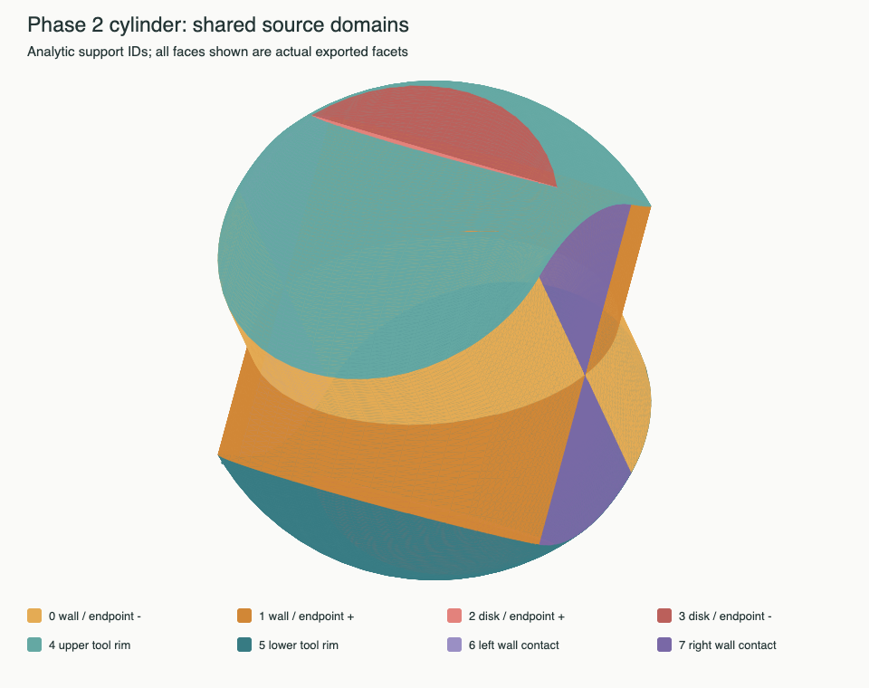
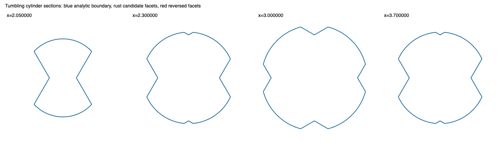

# Phase 2: shared source domains on the cylinder

Implementation on `56f98c4`. **The explicit cylinder atlas and three perturbations pass full
interval acceptance at spatial tolerance 0.04 with calibrated value/probe settings.** The
ordinary production sweep path remains unchanged; its tracer-chart integration is Phase 3.

This is an isolated construction experiment against the
frozen [Phase 1a baseline](swept-boundary-phase-one-a.md). It reconstructs the complete
interacting group, including both roll endpoints and both extremal contact faces.
There is no retained outer interface whose validity is assumed.

## What is implemented

`solid::swept_boundary::shared` tessellates already arranged parametric domains. Each
patch declares stable corner and curve identities, an evaluator, a source support ID
and minimum subdivision levels in its two parameters. Each shared edge is sampled once;
every consumer retains its own parameter coordinates for those same mesh indices.
Independent patch evaluations must agree at the declared shared parameters. Agreement
is checked at `1e-11` in this fixture; it does not identify nearby, unrelated geometry.

The graph checks opposite directed incidence, including curve identity rather than
endpoint identity alone. Distinct curves may share endpoints. Collapsed boundaries
are explicit equal-corner declarations, checked against their constant geometric image.
The resulting triangles retain their source support and three patch coordinates.
Refinement requests propagate across all incident edge consumers. Sampled chord error
then drives dyadic refinement, respecting a triangle budget. The prototype uses a
structured grid per domain and a common refinement increment; it does not yet optimize
interior refinement independently of the shared edges.

The assembler returns a candidate only after closed directed-edge and vertex-link
checks. It neither changes an input mesh nor creates an accepted swept solid. A missing
consumer, inconsistent evaluation, nonfinite point, invalid collapsed edge, degenerate
facet, topology error or exhausted budget refuses the proposal. Material visibility,
intersection checks and spatial acceptance remain separate obligations.

No production caller selects this backend yet. The original `candidate`/`construct`
path, geometric tolerances, field, certificate and spatial validator are unchanged.

## The fixture adapter and its limits

The current `SweepPatch` stores points, normals, triangle indices, columns and times.
It does **not** retain a source-face/edge identity, tool coordinates, a continuous sheet
evaluator, or visibility-event identity. Correcting triangle labels in Phase 1a did not
recover that information. Interpolating the existing facets cannot supply it.

Accordingly, `tests/sweep_mesh/cylinder_domains.rs` reconstructs an explicit analytic
atlas for the known source cylinder and x rotation. This is test support, not a general
sweep reader, a detector for arbitrary cylinders, or a production use of the independent
oracle. Its constructor imports neither the radial oracle nor the old reference mesh.
The old eleven source sheets remain preserved in the complete baseline replay. The
new atlas uses eight explicitly named analytic supports, which are **not** aliases of
those eleven sampled-sheet numbers:

- The cylinder wall at the two roll endpoints.
- The end disk at each roll endpoint.
- The two circular tool rims carried through their exposed roll intervals.
- Smooth-wall contact generators at the two x extrema.

For `a = sqrt(1-(x-3)^2)` and half roll `h`, the positive yz quadrant is arranged as:

1. The endpoint wall at roll `-h`, with tool z from `a tan(h)` to 1.
2. The rim point `(x,a,1)` carried from `-h` to `min(h, atan(a))`.
3. Where `a > tan(h)`, the endpoint disk at roll `h`, with tool y from `a` to `tan(h)`.

Reflection supplies the other quadrants. Opposed rim domains first coincide at
`a = tan(h)`; their shared y=0 curve selects one covering domain per quadrant. Splitting
at `x = 3 ± sqrt(1-tan(h)^2)` isolates the two events. At `x=2,4`, the smooth-wall
contact generator sweeps an actual sector, parametrized by radius and roll, with a
collapsed radial edge at the axis. These are source-supported faces, not hole-filling
fans. There are 36 arranged domains and 70 shared curve identities.

This arrangement is specific to `0 < h < pi/4`; its adapter explicitly excludes the
zero-roll and 45-degree topology changes. Global visibility follows the rectangle's
wall/disk/rim inequalities over the complete roll window and is checked separately by
the Phase 1 continuous oracle and the solved Solvent material field. These binary64
construction equations do not certify source-solve error or general event isolation.

## A second problem exposed by the experiment

Sharing edge indices fixes incidence; it does not guarantee useful facet normals.
The first isotropic 16-by-16 grid closed and had small sampled chord error, yet compressed
parameter rows near the x extrema made a rim triangle lean across its intended normal.
A non-centroid point on that triangle had no opposed material-side witnesses along its
facet normal at any of the fifteen tested probe distances from 0.04 downwards.

The exact failed triangle is retained in
[isotropic-rim.mesh](fixtures/cylinder-phase-two/isotropic-rim.mesh), with a permanent
independent negative control. It demonstrates why chord error and topology alone are
insufficient, even after shared boundary identities are correct.

The rim domains now request two extra dyadic levels in their angular parameter. Those
requests propagate through the common-edge graph to their consumers. The refined mesh
passes the same non-centroid side checks; no emitted triangle is repaired by aliasing,
welding, overlap deletion or zipper bands. This is a chart-resolution choice for the
experiment. A general adapter still needs differential/approximation information to
choose suitable sampling automatically.

Fixed-distance side probes are also reported unchanged. Near concave seams a long
normal offset can enter the neighboring material even on supported surface. Additional
local diagnostics search smaller offsets and keep that evidence distinct from both the
fixed-probe measurements and interval-certified acceptance.

## Validation protocol

Ordinary regressions cover the closed cube, full cylinder incidence and source/parameter
retention, inconsistent shared evaluations, missing consumers, exhausted budgets,
patch-order determinism, perturbed interior sampling and roll offsets of ±0.001 radian.
An independent facet-intersection checker has controls for a valid shared edge,
coplanar area overlap, and a crossing extending beyond a shared vertex. It uses binary64
predicates with a stated numerical tolerance; it is not an exact-predicate proof.

The ignored `shared::phase_two_cylinder_replay` reuses the Phase 1 reporter and oracle,
extracts the exact Phase 1a bundle, and compares the clipped and final baseline candidates
with the new complete group. It records common-edge consumer parameters, all triangle
source coordinates, side-area quadrature, volume convergence, independent sections,
facet intersections and distances to triangles in both directions. Four points per
candidate triangle measure forward distance; analytic references at resolutions 32,
64 and 128 measure reverse coverage. These remain sampled diagnostics.

The unchanged strict validator receives the solved Solvent field. The default reporter
uses a deliberately small 256-visit budget and retains its explicit refusal. The positive
acceptance run uses spatial tolerance 0.04 with the Phase 0a calibration allowance of
800,000 visits and depth 36, plus the value/probe refinements detailed below. A larger
resource allowance does not relax the geometric tolerance or accept unfinished work.
Successful centroid witnesses and unresolved spatial obligations are retained separately.
The assembler's sampled sagitta is 0.004, finer than the baseline's 0.02 setting; the
comparison therefore tests the architecture at stated resolution, not equal-cost output.

## Measured geometry

The final construction requests minimum angular level 2 on the rim domains and reaches
common refinement increment 4. It has 24,258 vertices and 48,512 triangles, with maximum
sampled chord error 0.0028911863. Directed incidence and vertex links form one closed shell.
No unexpected intersections were found at the checker’s numerical tolerance of `1e-9`.

| diagnostic | Phase 1a final candidate | shared-domain candidate |
|---|---:|---:|
| triangles | 6,033 | 48,512 |
| open loops | 13 | 0 |
| triangle area | 27.925501 | 23.490129 |
| reversed area, 64 samples/facet at probe 0.02 | 1.910498 | 0 |
| other fixed-probe area, 64 samples/facet | — | 0.000080717 |
| maximum sampled reference-to-mesh distance, reference 128 | 0.033879149 | 0.001781587 |
| maximum sampled mesh-to-reference distance, reference 128 | not recorded | 0.001709490 |
| closed mesh volume | unavailable: open mesh | 9.412744895 |

The independent volume quadrature at resolution 1024 gives 9.426350472; the mesh differs
by 0.013605576 (about 0.144%). All three independent reference resolutions report zero
sampled area beyond 0.01 in either distance direction. The fixed-probe “other” area is
preserved rather than reclassified as supported. Separate local checks find strictly
opposed oracle sides at four barycentric points of every triangle, searching fifteen
dyadic probe distances starting at 0.04. These are finite samples, not an orientation
certificate over every point.

Reversing the patch list produces byte-identical coordinates, indices and support labels.
With an interior parameter warp of 0.1 and half-roll offsets `-0.001`, `0`, `+0.001`
radians, the greatest sampled difference from the unperturbed mesh, in either direction,
is 0.002513609. All three variants pass topology, intersection and local side checks.
This does not establish robustness to perturbing the production tracer’s sampled seeds,
which the explicit chart adapter does not consume.





## Acceptance calibration on this nonconvex fixture

The default validation settings certify 48,488 centroids, fail none, and leave 24
unresolved rim triangles with total area 0.000073340. All 24 belong to the carried rim
supports, near the x extrema. The small audit retains 76 forward witnesses, 59 reverse
witnesses and the explicit remaining partitions; it refuses acceptance.

An 800,000-visit run using the default value/probe settings was interrupted after exceeding
14 minutes. A stack sample places the work in spatial-audit normal-line bracket searches
and field evaluation, not the tessellator. It has no completed spatial result. The bounded
run independently establishes the unchanged centroid refusal, so continuing the larger
run with those settings cannot produce acceptance.

`SweptBoundaryOptions::vertex_tolerance` couples the field-value refinement width
(half that setting) and minimum normal-probe distance (twice it). Both must change for
these 24 triangles; merely saying that the field needs more precision would be incomplete.
The isolated control holds the triangle coordinates, initial probe 0.04, field and query
budgets fixed:

| field-value width | least allowed normal probe | certified among the 24 |
|---:|---:|---:|
| 0.0025 | 0.01 | 0 |
| 0.0025 | 0.00002 | 0 |
| 0.000005 | 0.01 | 0 |
| 0.000005 | 0.00002 | 24 |

With validation-only `vertex_tolerance = 0.00001`, every centroid has a strict bracket.
The smallest probe actually used is 0.000625. The geometric mesh and the **whole-surface
spatial tolerance of 0.04 remain identical**. This is explicit calibration of the existing
validator, not a new rule for accepting `Near`, skipping triangles or interpreting residuals
as distances. Applying this small setting to the legacy constructor would also change its
trimming tolerances; that was not done and is not recommended by this experiment.

The primary full refined audit passes the actual `BoundaryReport::into_accepted` gate:
48,512 certified centroids, no failed or unresolved centroids, 157,652 forward witnesses,
100,126 reverse witnesses and zero unfinished obligations. It visits 266,792 forward
subtriangles and 200,251 reverse cells. The initial successful run took 68.675 seconds and
28,556,988 roll evaluations. Intermediate query-limit counts describe boxes later resolved
by subdivision, not outstanding acceptance failures. Timings overlap other checks and are
not isolated one-core benchmarks.

This calibration exposes a useful API boundary for the next phase: construction vertex
spacing, field-value refinement and the permitted side-probe scale should be independently
expressible. The successful setting is evidence for this fixture, not a universal new default.

The final combined replay also validates each perturbed mesh against its own Solvent roll
interval. Every row has 48,512 certified centroids, no failed or unresolved centroids, zero
unfinished spatial obligations and a closed shell of Euler characteristic 2:

| configuration | forward visits | reverse visits | accepted distance bound | audit seconds |
|---|---:|---:|---:|---:|
| primary, no warp | 266,792 | 200,251 | 0.0399998691 | 82.545 |
| warp 0.1, roll −0.001 rad | 269,644 | 199,129 | 0.0399999845 | 81.995 |
| warp 0.1, unchanged roll | 268,800 | 200,143 | 0.0399999316 | 67.986 |
| warp 0.1, roll +0.001 rad | 267,944 | 199,571 | 0.0399999006 | 62.681 |

The normal core suite passed **1,246 tests**. The final explicit Phase 2 run passed **all
10 tests**, including all four normally ignored replay/calibration/acceptance modes, in
213.20 seconds. The final production module is the one tested by the full core run;
subsequent test-only additions isolated probe settings and validated the perturbed meshes.
Both section and source-ownership renders were inspected, and their input mesh is byte-identical
to the final replay. `git diff --check` passed. No production export path was changed.

## Decision and next step

The bounded construction experiment succeeds for its explicit source atlas. Common boundaries,
properly split visibility domains and suitable parameter sampling produce supported geometry
that passes the existing field acceptance contract. The default refusal remains visible and
is resolved by explicit calibration; no acceptance requirement was removed.

Phase 3 should now retain source identities and native parameters through tracing, provide
continuous evaluators and trim-event identities, and reproduce this result through the ordinary
Solvent sweep path. It should also expose construction resolution, field-value refinement and
minimum side-probe scale independently. The working calibration is sufficient to start that
integration; a new validator rewrite is not a prerequisite. Keep the new compressed-chart
negative control alongside the earlier alias/zip controls. Restore the ordinary cylinder
acceptance test only after that production path succeeds, then extend to other tools/motions.

This result does not provide a general arrangement solver, exact intersection predicates,
encoded STL/STEP validation, thin-feature/isotopy guarantees or hypoid-gear acceptance. These
remain the later phases' explicit obligations.

## Durable replay and reproduction

The [replay bundle](fixtures/cylinder-phase-two/replay.tar.gz) includes the mesh, source,
options, domain/edge/consumer coordinates, all four acceptance reports, primary accepted
centroid witnesses, default unresolved centroid details, bounded spatial witnesses, variant
sources/meshes, renders, validation logs and a Rust source overlay on `56f98c4`. The
[manifest](fixtures/cylinder-phase-two/manifest.json) identifies the exact Phase 1a baseline
archive and records sizes and SHA-256 hashes. Every archived member was read back and checked.

The full successful spatial-witness arrays and extra certificate dumps total more than a
gigabyte. They remain in the local final run at `/private/tmp/swept-boundary-phase2-final`;
the manifest records their hashes as deliberately omitted, regeneratable reports. This keeps
the repository replay small without treating omitted or unfinished validation as passed.
The primary full certificate, complete acceptance results and exact replay inputs are included.
Timing fields can differ on replay, so hashes identify the recorded artifacts rather than
promise identical timing output.

[Geometry report](fixtures/cylinder-phase-two/report.txt),
[acceptance matrix](fixtures/cylinder-phase-two/acceptance.json) and
[isolated probe controls](fixtures/cylinder-phase-two/probe-controls.txt) are readable without
extracting the archive. The archived default-settings long run was interrupted; only its
geometry diagnostics and stack sample are evidence. Its replacement bounded report and
all four refined acceptance runs completed normally.

Run the complete final experiment in a separate output directory:

```sh
SOLVENT_EXPORT=/private/tmp/cylinder-phase2 \
SOLVENT_AUDIT_VERTEX_TOLERANCE=0.00001 SOLVENT_AUDIT_CELLS=800000 \
  cargo test --manifest-path rust/Cargo.toml -p gcs-core --test core \
  sweep_mesh::shared -- --include-ignored --nocapture
```

For the default-settings refusal alone, run `shared::phase_two_cylinder_replay` with
`--ignored --nocapture` and only `SOLVENT_EXPORT` set. It retains a 256-visit audit report;
it does not repeat the expensive unrefined 800,000-visit run. The full primary acceptance
case is `shared::phase_two_bounded_audit` with the two refinement environment variables
above. `shared::phase_two_perturbed_acceptance` validates the three variants;
`shared::phase_two_probe_controls` isolates value width from probe scale. The acceptance
cases construct their own domains and do not depend on another test creating files first.

`render.py` beside the manifest creates the ownership SVG from `shared.mesh`; the default
reporter creates the independent section SVG. Both can be viewed or rasterized in a browser.
